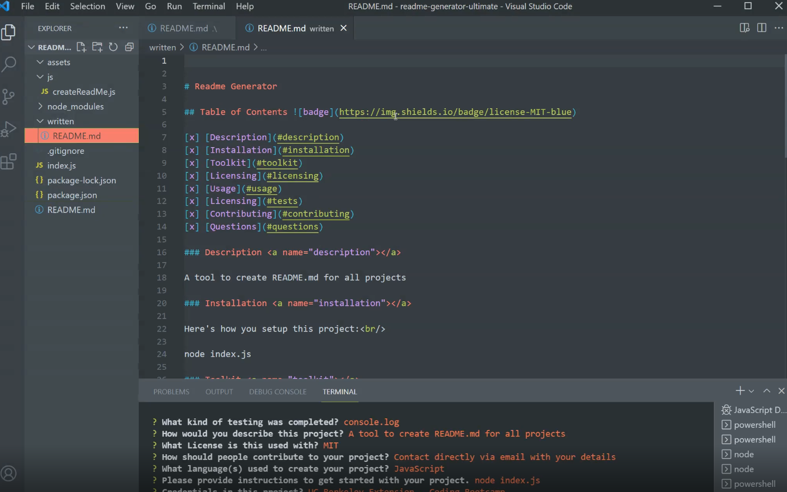

## Professional README Generator

### README.md Generator

A node.js program is used to create README.md by asking the user a series of inquirer-driven questions. 
The README.md is generated in the 'written' folder.

### Built With

* [x] HTML / Markdown

* [x] Node.js

* [x] Inquirer

* [x] Axios

* [x] utils


### Installation & Usage

* [x] Step 1: The following command is used to initiate the application at the root of your project:
```
node index.js
```
* [x] Step 2: Provide responses to all questions.

* [x] Step 3: Check your new README.md file output in the "written" folder.

### Demo



Large file, so see here: [Video of demo](https://vimeo.com/660478517) or reference in the assets file.

https://user-images.githubusercontent.com/71200950/147503070-27c1635e-065a-4ec8-af41-e591f669c414.mp4

### User Story

> AS A developer       
> I WANT a README generator       
> SO THAT I can quickly create a professional README for a new project       

### Acceptance Criteria 

> GIVEN a command-line application that accepts user input       
> WHEN I am prompted for information about my application repository       
> THEN a high-quality, professional README.md is generated with the title of my project and sections entitled Description, Table of Contents, Installation, Usage, License, Contributing, Tests, and Questions       
> WHEN I enter my project title       
> THEN this is displayed as the title of the README       
> WHEN I enter a description, installation instructions, usage information, contribution guidelines, and test instructions       
> THEN this information is added to the sections of the README entitled Description, Installation, Usage, Contributing, and Tests       
> WHEN I choose a license for my application from a list of options       
> THEN a badge for that license is added near the top of the README and a notice is added to the section of the README entitled License that explains which license the application is covered under       
> WHEN I enter my GitHub username       
> THEN this is added to the section of the README entitled Questions, with a link to my GitHub profile       
> WHEN I enter my email address       
> THEN this is added to the section of the README entitled Questions, with instructions on how to reach me with additional questions       
> WHEN I click on the links in the Table of Contents       
> THEN I am taken to the corresponding section of the README          

## Acknowledgement, & Resources

### Information and Resources Used

* [x] [Axios - Promise based HTTP client for the browser and node.js](https://www.npmjs.com/package/axios)

* [x] [Contributor Covenant](https://www.contributor-covenant.org/)

* [x] [Inquirer Package](https://www.npmjs.com/package/inquirer)

* [x] [Licenses](https://choosealicense.com/)

* [x] [Mastering Markdown](https://guides.github.com/features/mastering-markdown/)

* [x] [Official README.md Guide](https://github.com/coding-boot-camp/potential-enigma/blob/master/readme-guide.md)

* [x] [shields.io](https://shields.io/)

* [x] [Utils - Fast, generic JavaScript/node.js utility functions.](https://www.npmjs.com/package/utils)

